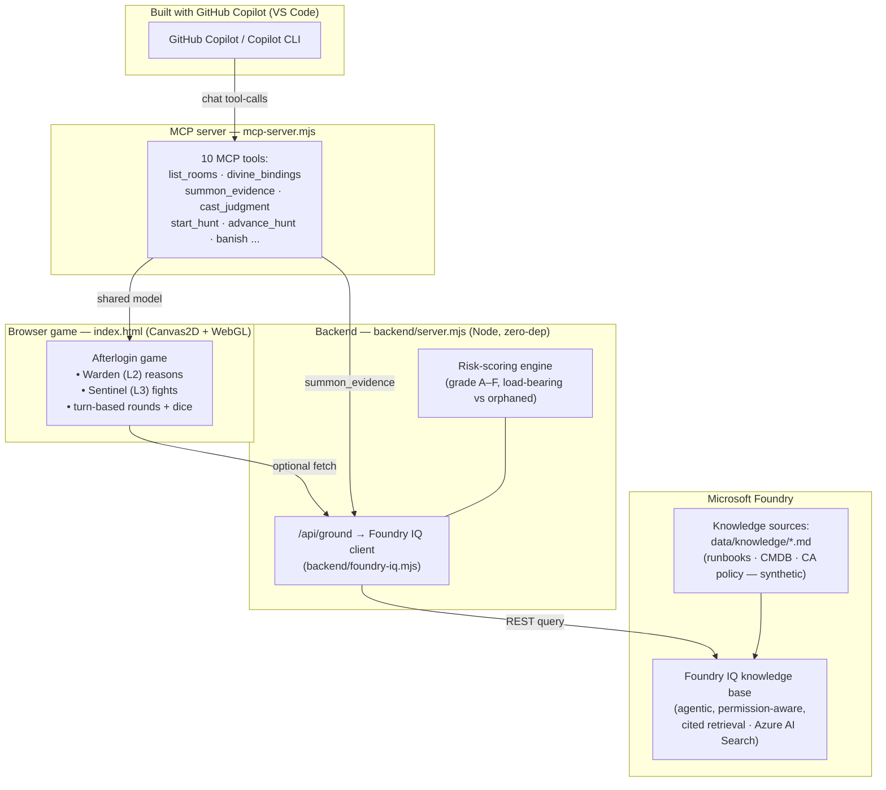

# Afterlogin — Architecture

**Track:** Creative Apps (built with **GitHub Copilot**) · **IQ layer:** Foundry IQ (+ Fabric IQ / Work IQ modelled)

Afterlogin is a single-file, offline-first web game that turns identity-governance
triage into a turn-based, D&D-style encounter. The **same model** powers three surfaces:
the browser game, an **MCP server** (so GitHub Copilot can play it), and a **REST backend**
with a risk-scoring engine and **genuine Foundry IQ grounded retrieval**.

## Diagram



## How each Microsoft technology is used

| Tech | Role |
|---|---|
| **GitHub Copilot** | The app is developed with Copilot in VS Code; the **MCP server** lets Copilot/Copilot CLI *play the manor headlessly* (the "built for Copilot" surface). |
| **Foundry IQ** | **Genuine integration** (`backend/foundry-iq.mjs`): agentic, permission-aware, **cited** retrieval over a knowledge base (Azure AI Search) of synthetic runbooks/CMDB/CA-policy docs. Drives the agent's evidence ("the grimoire"). Falls back to baked synthetic evidence when unconfigured so the demo runs offline. |
| **Fabric IQ** *(modelled)* | The identity **ontology** — account → owns → mailbox, → member-of → group, → invoked-by → live job — is what decides "is this ghost truly dead or load-bearing?" Rendered as the spirit-threads. |
| **Work IQ** *(modelled)* | Work-context signals (owner status, last activity) inform the recommendation. |

## Data flow (one round)

1. **Investigate** a ghost → **Divine** (Fabric IQ ontology threads) → **Summon** (Foundry IQ cited evidence).
2. The **Warden (L2)** agent reasons over the grounded evidence and **recommends** a rite.
3. You **judge** (Lay to Rest / Bind & Watch / Acknowledge) → one **round** resolves: your party's **Sentinel (L3)** rolls a d20 attack on the monster, then the monster advances toward the Vault.
4. **Banish** the monster (dice combat) before it reaches the Vault; clear all spirits = dawn.

## Files
```
index.html            game (Canvas2D + WebGL bloom, turn engine, agents, dice)
mcp-server.mjs        MCP server — GitHub Copilot plays it; Foundry IQ-grounded evidence
backend/server.mjs    REST API + risk-scoring engine
backend/foundry-iq.mjs Foundry IQ grounded-retrieval client (Azure AI Search)
data/identities.json  synthetic Entra-style dataset
data/knowledge/*.md   synthetic knowledge corpus to index into Foundry IQ
```
*Synthetic data only — no PII, secrets, or confidential information.*
