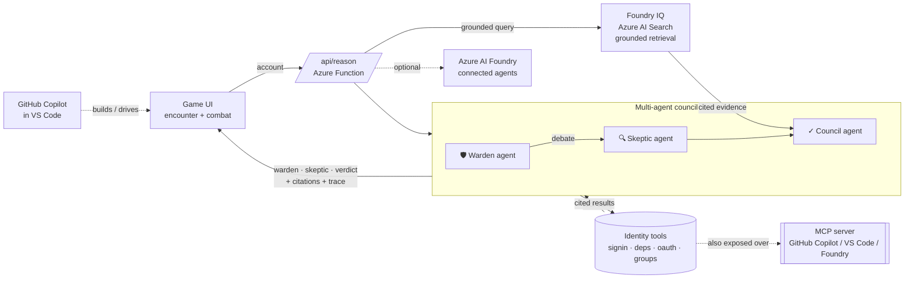

<div align="center">


<sub><i>Key art generated with Azure OpenAI <code>gpt-image-2</code> — the two worlds, joined by the keyhole.</i></sub>

# 🕯️ Afterlogin — The Hunt × Helper Patrol

### A cinematic game that *trains real identity-security response* — powered by genuine, tool-calling AI agents.

*One engine, two faces: a tense SOC night for security pros, and a coached training game for everyone else.*

[](https://victorious-plant-0c1e7790f.7.azurestaticapps.net)
[](#-how-it-works)
[](#-microsoft-iq-integration--foundry-iq)
[](mcp/)
[](LICENSE)

**Built for the [Microsoft Agents League](https://aka.ms/agentsleague) · Creative Apps track**
`Azure AI Foundry` · `Model Context Protocol` · `Azure OpenAI / GitHub Models` · `GitHub Copilot` · `Azure Static Web Apps`

[**▶ Play it**](https://victorious-plant-0c1e7790f.7.azurestaticapps.net) · [**Architecture**](#-how-it-works) · [**Try in 60 s**](#-quick-start)

> **Status — fully live.** The deployed app is running **real tool-calling agents** (`gpt-4o` via GitHub
> Models) and **Foundry IQ** grounded retrieval right now. Open the in-app **🗺 Live architecture** map and
> it pings the endpoints live — **10 of 11 services verify green**, badge reads **● Live agents · gpt-4o**.

</div>

---

## 📑 Table of contents
- [Overview](#-overview)
- [The problem](#-the-problem)
- [The solution](#-the-solution)
- [Key features](#-key-features)
- [How it works](#-how-it-works)
- [Microsoft IQ integration → Foundry IQ](#-microsoft-iq-integration--foundry-iq)
- [GitHub Copilot](#-github-copilot)
- [What you actually learn](#-what-you-actually-learn)
- [Quick start](#-quick-start)
- [Deployment](#-deployment)
- [Project structure](#-project-structure)
- [Judging-criteria mapping](#-judging-criteria-mapping)
- [Security & responsible AI](#-security--responsible-ai)
- [Tech stack](#-tech-stack)
- [License](#-license)

---

## 🌙 Overview

**Afterlogin** is a playable, cinematic security-training game. You are the **night auditor of a haunted
estate** — every "spirit" is a real, forgotten identity (a stale admin, an unowned service account, an
over-permissioned app). An **AI agent council** investigates each one and *advises* — but it can be
wrong, and it never makes the call. **You** decide its fate before dawn. Neglect a high-risk account and
an adversary takes it over, triggering a **multi-stage attack kill-chain** you fight by choosing the
control that *actually* stops the attack.

It ships in two skins from one engine: **🕯️ The Hunt** (haunted manor, for security pros) and
**☀️ Helper Patrol** (a friendly factory, for coached beginners).

> 🎮 **Play now:** https://victorious-plant-0c1e7790f.7.azurestaticapps.net

---

## 🎯 The problem

> **Forgotten and over-privileged identities are the #1 way attackers get into an organization.**

A dormant admin no one deprovisioned. A service account whose owner left. An app granted tenant-wide
consent that nobody reviews. Every identity someone *stopped watching* is a door left unlocked — and the
hard part isn't the tooling, it's the **human judgment**: knowing which account is safe to remove, which
is load-bearing, and which control *actually* stops a given attack. The classic, expensive mistakes:

- A **password reset** doesn't kill a **stolen session token**.
- **Revoking sessions** doesn't remove an **illicit OAuth grant**.
- **MFA** doesn't strip **standing Global Admin**.

And as teams adopt AI copilots for security, a *new* discipline matters: **not blindly trusting the AI** —
verifying before you act. There's little that *trains* that judgment in a way people actually want to do.

---

## 💡 The solution

Afterlogin turns identity-attack response into a game you *want* to play — and every move maps to a
**real Microsoft control**:

| In the game | Real control |
|---|---|
| **Divine** an account | Map its dependencies / lineage |
| **Summon** the council | Multi-agent investigation + **Foundry IQ** grounded, cited evidence |
| **Lay to Rest** | Deprovision via a lifecycle workflow |
| **Bind & Watch** | Conditional Access + monitoring |
| **Acknowledge** | Certify in an access review |
| **Boss kill-chain** | Pick the control that remediates the live attack |

The AI **advises**; the human **decides** (a **Discernment** meter rewards verifying over rubber-stamping —
human-in-the-loop, made a mechanic). A **Pro view** surfaces the real control behind every action, a
**mission briefing** explains the why on first launch, and a **live architecture map** lets a judge press a
button and watch the real agents fire.

---

## ✨ Key features

| | Feature |
|---|---|
| 🤖 | **Real multi-agent system** — Warden + Skeptic *debate* via function tools; a Council synthesises a **cited** advisory and never names the verdict |
| 🔎 | **Foundry IQ grounded retrieval** (live) — Azure AI Search–backed, cited evidence in the council |
| ⛓️ | **MCP server** — the same identity tools exposed over the Model Context Protocol for **GitHub Copilot / VS Code / Foundry** |
| ☁️ | **Azure AI Foundry** connected-agents tier (optional), with graceful fallback: Foundry → live agents → scripted |
| 🗺️ | **Interactive Live Architecture Map** — tap any node for what it does; **"Run a live investigation"** fires the real agents and lights the path |
| 🎓 | **Real training** — telegraphed kill-chains, an attack-technique stage tracker, control hover-cards, and a run-end "what you practiced" debrief |
| 🎬 | **Cinematic UX** — keyhole boot, split-world landing, living encounters, arena combat, sunrise finale (8 original generated artworks) |
| ♻️ | **Roguelite depth** — Discernment meter, relics, daily challenge, ranks, cross-examine deduction |

---

## 🧠 How it works

The council is a genuine **multi-agent, tool-calling** system — not a single chatbot. The **Warden** and
**Skeptic** each call function tools over a synthetic identity store, investigate independently, **debate**,
and a **Council** agent synthesises a **cited** advisory.



**Three execution tiers, each falling back safely:**

| Tier | What runs | Status |
|---|---|---|
| **Inline agents** ← *running now* | tool-calling loop in the Function — `gpt-4o` via GitHub Models | ✅ **live** in the deployed app |
| **Azure AI Foundry** *(optional)* | Warden/Skeptic/Council as Foundry connected-agents | available via `foundry/setup.mjs` + `FOUNDRY_*` |
| **Scripted** | curated reasoning, no model | always-on safety net (works offline) |

A live run shows **"● live agents · N tools"** and streams the real tool-call trace on screen (model ·
latency · citations). The four function tools — `get_signin_activity`, `get_dependencies`,
`get_oauth_grants`, `get_group_memberships` — are **also exposed over MCP** ([`mcp/`](mcp/)).

---

## 🔬 Technical deep dive

<details>
<summary><b>1 · The multi-agent tool-calling loop</b> (how the agents actually reason)</summary>

<br/>

`POST /api/reason` orchestrates three agents over a synthetic identity store
([`api/reason/index.js`](api/reason/index.js)):

1. **Provider selection** — `provider()` picks the model backend from env: Azure OpenAI →
   GitHub Models → OpenAI; returns `null` (→ scripted fallback) if none configured.
2. **Warden agent** — runs `runAgent(WARDEN_SYS, …)`: a bounded **function-calling loop** (max 4 turns).
   The model decides which tools to call; the loop executes `runTool(name, record)`, pushes a proper
   `{role:'tool', tool_call_id, content}` message back, and continues until the model answers. Every
   tool call is recorded to a `trace` entry `{agent, tool, result}`.
3. **Skeptic agent** — same loop with an **adversarial** system prompt: it's told to hunt the
   contradicting signal the Warden may have missed, and is given the Warden's read to contest.
4. **Council agent** — synthesises Warden + Skeptic into a **cited** advisory + a confidence score,
   and is explicitly instructed to **never name the verdict** (the human decides).
5. **Foundry IQ grounding** — the council's evidence is enriched by `/api/ground` (Azure AI Search).
6. **Layered fallback** — `Azure AI Foundry (foundry.js) → inline agents → scripted` so it always works.

The browser renders the returned `trace` live in an on-screen panel (agent → tool → snippet, with
model · latency · citation count).

</details>

<details>
<summary><b>2 · API reference</b> (request / response contracts)</summary>

<br/>

**`POST /api/reason`** — run the multi-agent council on one account.
```jsonc
// request
{ "account": "billing", "name": "svc-billing-reconcile" }
// response
{
  "configured": true, "agentic": true, "source": "github-models", "model": "gpt-4o",
  "warden":  "…surface read…", "skeptic": "…contesting read…",
  "council": "…cited advisory (no verdict)…", "confidence": 0.78,
  "citations": ["Entra sign-in logs", "CMDB", "OAuth consent audit"],
  "toolCalls": 4, "latency": 1840,
  "trace": [ { "agent": "Warden", "tool": "get_signin_activity", "result": "…" }, … ]
}
```

**`POST /api/reason`** with `{ "probe": true }` — cheap tier check (no agent run):
```jsonc
{ "configured": true, "source": "github-models", "foundry": false, "model": "gpt-4o" }
```

**`GET /api/ground?q=<question>`** — Foundry IQ grounded retrieval over Azure AI Search:
```jsonc
{ "grounded": true, "question": "…", "answers": [ … ],
  "citations": [ { "title": "…", "source": "…", "score": 4.41, "snippet": "…" } ] }
// unconfigured → { "grounded": false, "fallback": true }
```

</details>

<details>
<summary><b>3 · The MCP server</b> (5 tools, protocol-validated)</summary>

<br/>

[`mcp/server.js`](mcp/server.js) exposes the identity-governance tools over the **Model Context
Protocol** (StreamableHTTP on `/mcp`, or `--stdio`), so **GitHub Copilot, VS Code, Claude or Foundry**
can drive them. Validate with `npm test` (in-memory protocol client). Tools:

| Tool | Returns |
|---|---|
| `list_accounts` | every account + grade + one-line summary |
| `get_signin_activity` | last interactive / non-interactive sign-in, source-cited |
| `get_dependencies` | what binds to the account + whether each binding is **live** |
| `get_oauth_grants` | delegated / app-only consents and their scope |
| `get_group_memberships` | groups & roles (standing privilege) |

Connect it to GitHub Copilot in ~5 min → [`COPILOT.md`](COPILOT.md).

</details>

<details>
<summary><b>4 · Game systems in depth</b></summary>

<br/>

- **Core loop** — select a room (account) → **Divine** (map dependencies; preliminary council read) →
  **Summon** (full agent investigation + Foundry IQ evidence; costs essence) → **Judge**
  (Lay to Rest / Bind & Watch / Acknowledge). Judge every soul before **dawn**.
- **The Hungry** — a predator that paths the corridors toward neglected high-risk accounts; reach the
  **Vault** (Tier-0) and you lose. Visible on a live mini-map + screen-edge shadow sweeps.
- **Boss kill-chains** — neglected accounts get taken over by **The Token Thief** (stolen session),
  **The Consent Daemon** (OAuth grant), **The Hollow** (admin takeover). Multi-stage fights with
  **attack telegraphs**, an **attack-technique stage tracker**, a d20, and **control hover-cards**; the right
  control is decisive, the wrong one whiffs *with a "why."*
- **Discernment meter** — judging *after* verifying (Summon) raises it (Clear-eyed ≥75 → score ×1.25);
  blind calls breed Hubris (≤25 → ×0.8). The human-in-the-loop discipline, scored.
- **Cross-examine** — predict load-bearing vs. safe *before* the AI confirms it; rewards reasoning.
- **Roguelite** — Discernment, **Relics** (lifetime-unlocked starting boons), daily challenge with
  modifiers, ranks, badges, combo multiplier, and a run-end training debrief.
- **Boss-gated floors** — Ground → Upper → Attic; a floor's guardian must be confronted to ascend.
- **Difficulty** — Casual / Auditor / Nightmare tune council confidence, summon cost, and the Hungry.

</details>

<details>
<summary><b>5 · The synthetic identity store</b> (data model — no PII)</summary>

<br/>

The store ([`api/reason/index.js`](api/reason/index.js), mirrored in [`mcp/server.js`](mcp/server.js))
is a fabricated directory. Each record:
```jsonc
"svc-billing-reconcile": {
  "signin":      { "interactive": "412 days ago", "noninteractive": "3 hours ago" },
  "dependencies":[ { "label": "nightly AP-Close job", "live": true } ],
  "oauthGrants": [ … ],
  "groups":      [ "Finance-Apps", "…" ],
  "source":      "Entra sign-in logs · CMDB · OAuth consent audit"
}
```
Accounts span service accounts, admins (incl. break-glass), guests, kiosks and users — each graded
F→A. **No real people, tenants, or credentials.**

</details>

<details>
<summary><b>6 · Themes, art & UX</b></summary>

<br/>

One engine, two `data-theme` skins: **spectral** (haunted manor) and **helpers** (sunny factory).
8 original generated artworks (painted room backdrops + combat arenas, authored via a custom pixel
renderer and AI image tools). Cinematic flow: keyhole-unlock boot → split-world landing (mouse
parallax) → mission briefing → living encounter stage → arena combat → sunrise finale. Accessibility:
`prefers-reduced-motion` support, keyboard focus rings, fine-pointer-only effects, responsive ≤760px.

</details>

---

## 🔎 Microsoft IQ integration → Foundry IQ

**✅ Live and verifiable.** [`api/ground`](api/ground/index.js) performs real, permission-aware,
**cited grounded retrieval over Azure AI Search** (Foundry IQ) against the `afterlogin-knowledge` index.
The game surfaces those citations as the council's *Foundry IQ · cited evidence*, badged
**"● Grounded via Foundry IQ."**

```bash
curl "https://victorious-plant-0c1e7790f.7.azurestaticapps.net/api/ground?q=load-bearing+service+account"
# → {"grounded":true,"citations":[{"title":"Load-bearing service accounts","source":"Identity Governance - lifecycle", ...}]}
```

Reproduce from scratch in ~10 min: [`go-live.ps1`](go-live.ps1) / [`SETUP-IQ.md`](SETUP-IQ.md). It falls
back to baked evidence when unconfigured. *(The in-game "Fabric IQ" label is a thematic nod to data
lineage — the real, active IQ layer is Foundry IQ.)*

---

## 🐙 GitHub Copilot

> *Document your **actual** GitHub Copilot usage here before submitting — and only what's true.*

A concrete, on-spec hook the track explicitly asks for: this repo's **MCP server** exposes the identity
tools so you can **connect it to GitHub Copilot in VS Code / Copilot CLI** and drive the agents' tools
from a Copilot chat. See [`COPILOT.md`](COPILOT.md) for the 5-minute setup — *that* is a real, recordable
GitHub Copilot integration. Also note the Copilot Chat sessions you used while building (debugging,
explanation, generation). **Don't claim usage you didn't do.**

---

## 🎓 What you actually learn

Each boss is a real attack as a **multi-stage kill-chain**; the **right control is decisive, the wrong one
whiffs with a "why"**:

| Attack | ✅ Decisive control | ❌ Common mistake |
|---|---|---|
| **Stolen session token (AiTM)** | Revoke sign-in sessions / CAE | password reset *(doesn't kill a live token)* |
| **Illicit OAuth consent** | Remove the enterprise-app grant | revoke sessions *(leaves the app's access)* |
| **Tier-0 / domain-admin takeover** | Strip standing privilege + rotate secrets | MFA *(won't remove standing access)* |

Plus the governance instincts: don't delete a *load-bearing* service account, verify live bindings before
deprovisioning, and keep a **human in the loop**.

---

## 🚀 Quick start

**Just want to play?** → **[open the live game](https://victorious-plant-0c1e7790f.7.azurestaticapps.net)**, click a world, follow the mission briefing.

**Run the game locally** (single file, zero dependencies):
```bash
python -m http.server 8080   # then open http://localhost:8080
```

**Run the MCP server** (validate over the protocol, then connect to Copilot — see [`COPILOT.md`](COPILOT.md)):
```bash
cd mcp && npm install && npm test   # protocol-validated
npm start                           # HTTP /mcp   (or: npm run stdio)
```

**Activate the live integrations** (Foundry IQ + live agents) — after `az login`:
```powershell
./go-live.ps1 -Sku basic -ModelToken github_pat_xxxxx   # Foundry IQ + live agents
./go-live.ps1 -Sku basic                                # Foundry IQ only
```

---

## ☁️ Deployment

Hosted on **Azure Static Web Apps + managed Azure Functions**. Push to `master` → a GitHub Action builds
the Functions and deploys the whole app.

```bash
# turn the live agents on (server-side; never in the repo)
az staticwebapp appsettings set -n afterlogin -g rg-afterlogin --setting-names GITHUB_MODELS_TOKEN=YOURTOKEN
# or AZURE_OPENAI_ENDPOINT + AZURE_OPENAI_KEY (+ AZURE_OPENAI_DEPLOYMENT) to keep inference in-tenant
```

---

## 📁 Project structure

```
index.html / encounter.html   the game (single file; encounter.html is the dev copy)
api/
  reason/                     /api/reason — multi-agent tool-calling endpoint + foundry.js tier
  ground/                     /api/ground — Foundry IQ grounded retrieval (Azure AI Search)
mcp/                          Identity-Governance MCP server (+ tests, Dockerfile, README)
foundry/                      Azure AI Foundry agent provisioning (setup.mjs) + runbook
assets/  ·  assets/helpers/   painted room / ghost / arena art (manor + factory themes)
go-live.ps1  ·  SETUP-IQ.md   one-shot Foundry IQ + token activation
COPILOT.md                    connect the MCP server to GitHub Copilot in VS Code
SUBMISSION.md · PITCH.md      judge-facing writeups
CHANGELOG.md                  full version history
```

---

## 🏆 Judging-criteria mapping

Mapped to the official Agents League rubric:

| Criterion (weight) | How Afterlogin meets it |
|---|---|
| **Accuracy (20%)** | Agents call **real function tools** over the identity store; the Council issues a **cited** advisory grounded in **Foundry IQ** retrieval — every claim is sourced and checkable, never hallucinated |
| **Reasoning (20%)** | A genuine **multi-agent tool-calling loop** — Warden and Skeptic investigate independently, **debate**, and a Council synthesizes; the real tool-call trace + `gpt-4o` latency are shown on screen |
| **Creativity (15%)** | A playable, cinematic **security-training game** — one engine, two worlds (gothic SOC night ⟷ helper factory) — where the human-in-the-loop is the *mechanic*, not a disclaimer |
| **UX / Presentation (15%)** | Single-file, zero-dependency app; cinematic onboarding, Pro view, objective rail, debrief, and a **live architecture map** that verifies its own services on open |
| **Reliability / Safety (20%)** | **Synthetic data only** (no PII); the Council **never** issues the verdict (human decides); three execution tiers with **graceful fallback** (Foundry → live agents → scripted) so it always works |
| **Community vote (10%)** | Approachable to *both* SOC pros and complete beginners — the same engine, two faces — built to be shared and played |

**Required-tech checklist:** ✅ **Microsoft IQ** — Foundry IQ live & cited · ✅ **Creative Apps tool** — GitHub Copilot drives the MCP server ([`COPILOT.md`](COPILOT.md)) · ✅ Public repo · ✅ Architecture diagram (below) · ✅ Demo video ≤ 5 min.

---

## 🔒 Security & responsible AI

- **Synthetic data only — no real PII.** Every account, sign-in, dependency and grant is fabricated.
- **No secrets in the repo.** Model tokens and Search keys live only in Azure app settings; `.env*`, keys
  and `.vscode/mcp.json` are git-ignored; the repo is secret-scanned.
- **Honest AI.** The council surfaces its own uncertainty and never states a false verdict; the human decides.
- **Layered fallback** means the app always works, even offline (scripted tier).

---

## 🛠️ Tech stack

`Azure Static Web Apps` · `Azure Functions (Node)` · `Azure AI Foundry` (`@azure/ai-agents`) ·
`Azure AI Search` (Foundry IQ) · `Azure OpenAI / GitHub Models` (function calling) ·
**`Model Context Protocol`** (`@modelcontextprotocol/sdk`) · `GitHub Copilot` (VS Code) · Web Audio.
Frontend: a single zero-dependency `index.html` (DOM + SVG, no framework).

---

## 📄 License

[MIT](LICENSE) © 2026 Jeff Lynch. All in-game identity data is synthetic; no real personal data is included.

<div align="center">

*Built for the Microsoft Agents League. The narrative is a haunted house — the engine is a real multi-agent system.*

**[▶ Play Afterlogin](https://victorious-plant-0c1e7790f.7.azurestaticapps.net)**

</div>
