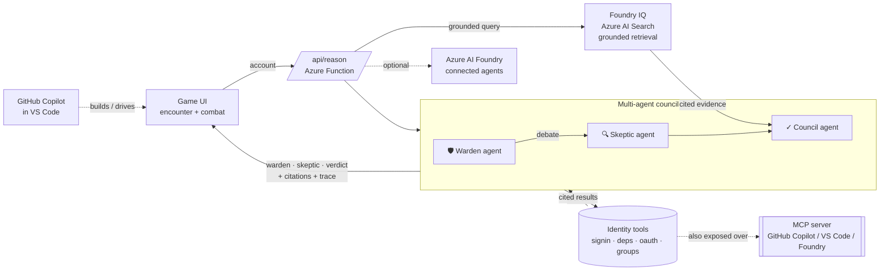

# 🕯️ Afterlogin: The Hunt

**A game that trains identity-attack response — powered by real, tool-calling AI agents.**
You're the night auditor of a haunted estate. Every "spirit" is a forgotten account; the
**Agent Council** investigates and advises, but *you* decide its fate — and when a neglected
account is taken over, you fight the **kill-chain** by choosing the control that actually
remediates the attack.

Built for the **Microsoft Agents League**. The narrative is a haunted house; the engine is a
real multi-agent system with function tools, the **Model Context Protocol**, and an optional
**Azure AI Foundry** agent path.

🎮 **Live:** https://victorious-plant-0c1e7790f.7.azurestaticapps.net
🎬 **Demo video:** [`afterlogin-demo.webm`](afterlogin-demo.webm) — a 2¼-min directed tour (agents · combat · dawn)
📖 In-game **"Behind the Game"** badge maps every element to the real Microsoft control.

---

## Why it's actually agentic (not a chatbot)

The council is a genuine **multi-agent, tool-calling** system. The **Warden** and **Skeptic**
each call function tools over an identity store, investigate independently, *debate*, and a
**Council** agent synthesises a **cited** advisory — and never names the verdict (human decides).



### ✅ Required-criteria checklist (Microsoft Agents League — Creative Apps)
- **Microsoft IQ integration → Foundry IQ.** `/api/ground` performs real permission-aware, **cited
  grounded retrieval over Azure AI Search** (Foundry IQ); the game surfaces those citations as the
  council's *Foundry IQ · cited evidence* with a "● Grounded via Foundry IQ" badge. Activate by
  provisioning a Search index + setting `FOUNDRY_SEARCH_*` (see [`SETUP-IQ.md`](SETUP-IQ.md)); falls
  back to baked evidence when unconfigured. *(The in-game "Fabric IQ" label is a thematic nod to data
  lineage, not a Fabric integration — the real IQ layer here is Foundry IQ.)*
- **GitHub Copilot** *(required — fill this in truthfully before submitting):* document your **actual**
  GitHub Copilot usage — which code Copilot helped write, Copilot Chat sessions for debugging/
  explanation, and ideally a short clip of Copilot in VS Code. A concrete, verifiable hook: the same
  identity tools are exposed over **MCP**, so you can connect this MCP server to **GitHub Copilot in
  VS Code / Copilot CLI** and drive the agents' tools from a Copilot chat — record that. *(Do not
  claim Copilot usage you didn't do.)*
- **Creative application.** A playable, cinematic security-training game — see the live URL + demo.
- **Architecture diagram.** Above.

**Three tiers, each falling back safely:**

| Tier | What runs | Activate |
|---|---|---|
| **Azure AI Foundry** | Warden/Skeptic/Council as Foundry connected-agents | `foundry/setup.mjs` + `FOUNDRY_*` settings |
| **Inline agents** *(default)* | tool-calling loop in the Function (Azure OpenAI / GitHub Models) | set a model token |
| **Scripted** | curated reasoning, no model | always works (offline) |

A live run shows **"● live agents · N tools"** and streams the real tool-call trace in an
on-screen panel (model · latency · citations).

---

## The tools (real, protocol-validated)

The agents call these over function-calling, and the **same tools are exposed over MCP**
([`mcp/`](mcp/)) so Copilot / VS Code / Claude / Foundry can drive them too:

- `get_signin_activity` · `get_dependencies` · `get_oauth_grants` · `get_group_memberships`

Each result is **cited** (Entra sign-in logs, Purview runbook index, CMDB, OAuth consent audit).
**Synthetic data only — no real PII.**

## Real attack-response training

Each boss is a real attack as a **multi-stage kill-chain**; the **right control is decisive, the
wrong one whiffs with a "why"** (the gotchas people get wrong):

- **Stolen session token (AiTM)** → ✅ Revoke Sessions · ❌ password reset *doesn't kill a live token*
- **Illicit OAuth consent** → ✅ Revoke the grant · ❌ revoking sessions *leaves the app's access*
- **Domain-admin compromise** → ✅ Strip PIM + rotate krbtgt · ❌ MFA *won't remove standing privilege*

The investigation loop teaches **identity governance**: don't delete a *load-bearing* service
account, verify live bindings before deprovisioning, and keep a human in the loop.

---

## Run it

**Game (static, zero-dep):**
```bash
python -m http.server 8080   # then open http://localhost:8080
```
**MCP server:**
```bash
cd mcp && npm install && npm test   # validate over the protocol
npm start                           # HTTP  /mcp   (or: npm run stdio)
```
**Foundry agents:** see [`foundry/README.md`](foundry/README.md).

## Deploy (Azure Static Web Apps + managed Functions)

Push to `master` → GitHub Action builds the Function and deploys the whole app.
Turn the live agents on with one app setting:
```bash
az staticwebapp appsettings set -n afterlogin -g rg-afterlogin --setting-names GITHUB_MODELS_TOKEN=<token>
# or AZURE_OPENAI_ENDPOINT + AZURE_OPENAI_KEY (+ AZURE_OPENAI_DEPLOYMENT) to keep inference in-tenant
```

## Tech
Azure Static Web Apps · Azure Functions (Node) · Azure OpenAI / GitHub Models · **Model Context
Protocol** (`@modelcontextprotocol/sdk`) · **Azure AI Foundry** (`@azure/ai-agents`) · Web Audio.
Frontend: a single zero-dependency `index.html` (DOM + SVG + Canvas-free).

## Repo
```
index.html              the game (also encounter.html, the dev copy)
api/reason/             /api/reason — inline multi-agent endpoint + foundry.js tier
mcp/                    Identity-Governance MCP server (+ Dockerfile, tests)
foundry/                Foundry agent provisioning (setup.mjs) + runbook
assets/                 painted room + ghost art
CHANGELOG.md            full history
```
